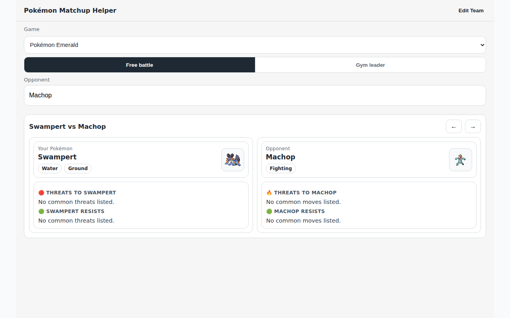

# Pokémon Matchup Helper

**[Live app → https://atniptw.github.io/probable-computing-machine/](https://atniptw.github.io/probable-computing-machine/)**

A fast, in-battle type matchup tool for Pokémon players. Search for your opponent's Pokémon, configure your team, and instantly see which of your Pokémon have the best type advantage — optimized for use mid-fight on any device.

---

## Features

- **Games supported:** Pokémon Red, Crystal, Emerald, Platinum, Black 2, X, Ultra Sun, Sword, and Scarlet (Gen 1–9)
- **Gym leader mode:** browse gym leaders for each game and select their Pokémon directly — no typing required
- **Type effectiveness:** full offensive and defensive matchup analysis, generation-aware for historical chart differences
- **Team configuration:** configure up to 6 Pokémon with up to 4 moves each; team persists locally per game

---

## Screenshot



---

## How to Use

See the [User Guide](docs/USER_GUIDE.md) for full instructions.

**Quick start:**

1. Select a **Game** to filter the Pokédex to that game's roster.
2. In **Free battle** mode, type 2–3 letters in the Opponent field and select from the instant suggestions.
3. In **Gym leader** mode, pick a gym and then a Pokémon from their team.
4. Tap **Edit Team** to add your Pokémon before your first battle.
5. Read the matchup cards — each shows type badges, what your Pokémon resists, and what threatens it.

---

## Disclaimer

This is an unofficial fan tool. Pokémon and all related names are trademarks of Nintendo, Game Freak, and Creatures Inc. This project is not affiliated with or endorsed by Nintendo or The Pokémon Company. Data is sourced from [PokéAPI](https://pokeapi.co).

---

## Development

```bash
npm install       # install dependencies
npm run dev       # start dev server → http://localhost:5173
```

### Validation

```bash
npm run lint
npm run tsc
npm run test
npx playwright test --project=chromium
```

### Core Docs

- [PROJECT.md](PROJECT.md) — project scope and success criteria
- [SESSIONS.md](SESSIONS.md) — session log and handoffs
- [DECISIONS.md](DECISIONS.md) — decision log with rationale
- [docs/USER_GUIDE.md](docs/USER_GUIDE.md) — user-facing how-to guide
- [docs/COMPONENT_DESIGN.md](docs/COMPONENT_DESIGN.md) — component architecture
